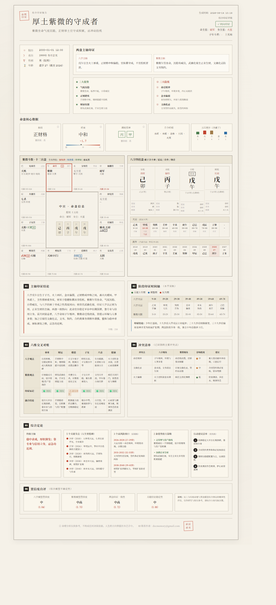

<div align="center">

# bazi-ziwei-skill

**An AI Skill for BaZi (Four Pillars) + Zi Wei Dou Shu charting & cross-validation**

Deterministic charting (not LLM guesswork) · 3 analysis modes · one-click ink-style HTML chart poster

[](./LICENSE)
[](#-installation)

[简体中文](./README.md) | English

<br>



<sub>Cross-validation poster sample (synthetic subject, for display only)</sub>

</div>

---

## What is this

A Chinese metaphysics analysis Skill following the [SKILL.md open standard](https://code.claude.com/docs/en/skills). It plugs into any compatible AI agent — Claude Code / Claude Desktop / Codex / Cursor / Hermes / OpenClaw, etc.

It does three things an LLM alone does poorly:

1. **Accurate charting**: the Four Pillars (BaZi), the twelve palaces of Zi Wei Dou Shu, and the luck/year cycles are all computed by a bundled algorithm library — **the LLM never charts on its own**. Pure-LLM charting routinely gets the day pillar, day master, or chart structure wrong, and one wrong step corrupts everything downstream.
2. **Structural enrichment**: on top of the raw chart, an extra layer computes "chart structure / strength / climatic adjustment / clashes-combinations-harms / capped-pillars", feeding the LLM grounded inputs.
3. **Cross-validation**: it reconciles the conclusions of two independent systems — BaZi and Zi Wei — checking whether their main axes agree, whether life windows line up, and which one to trust on conflict. This is the core value that "any LLM + any charting tool" cannot replicate.

---

## ✨ Features

- 🎯 **Accurate algorithm**: charting core derived from the open-source project Yiqi (MIT), verified against its UI; the enrichment layer passes multi-dimensional regression on 7 test cases
- 🧭 **3 analysis modes**: BaZi only / Zi Wei only / BaZi + Zi Wei cross-validation
- 📜 **2 output formats**: in-depth Markdown long-form + 🎴 single-file HTML poster (cross-validation only)
- 🎴 **Ink-style chart poster**: modern minimal × Chinese ink, with the Zi Wei 12-palace chart + BaZi four-pillar chart + six-dimension cross-check, ready to screenshot and share
- 🔌 **Cross-agent**: one SKILL.md, works across major agents
- 🔒 **Privacy-first**: all charting runs locally, no network needed; runtime artifacts are gitignored by default

---

## 🚀 Installation

### 1. Clone

```bash
git clone https://github.com/dzcmemory-web/bazi-ziwei-skill.git
```

### 2. Install algorithm dependencies

```bash
cd bazi-ziwei-skill/calculator
npm install
```
> Requires Node.js >= 18. Only one runtime dependency: `lunar-typescript` (MIT).

### 3. Register with your agent

Drop the whole `bazi-ziwei-skill/` folder into your agent's skills directory:

| Agent | skills directory |
|---|---|
| Claude Code / Claude Desktop | `~/.claude/skills/bazi-ziwei/` |
| Codex | `~/.codex/skills/bazi-ziwei/` or reference via project AGENTS.md |
| Cursor | reference from project `.cursor/` rules |
| Hermes Agent | `~/.hermes/skills/bazi-ziwei/` |
| OpenClaw | its skills directory / local ClawHub install |

The agent reads `SKILL.md` automatically and invokes it on demand.

---

## 📖 Usage

Once installed, just tell the agent a birth time:

```
I'm a male born at noon (12:00) on Jan 1, 2000. Read my chart.
```

The agent will:
1. Ask which analysis you want (BaZi / Zi Wei / cross-validation)
2. For cross-validation, ask long-form vs. HTML poster
3. Call the algorithm layer → load the matching prompt → output analysis or render the poster

See [`SKILL.md`](./SKILL.md) for the full flow and [`TEST-GUIDE.md`](./TEST-GUIDE.md) for testing.

### Charting directly from the CLI (no agent)

```bash
cd calculator
# chart -> JSON
node dist/run-chart.js --year=2000 --month=1 --day=1 --hour=12 --minute=0 --gender=male > chart.json
# JSON -> readable text chart
node dist/dump-text.js --input=chart.json --output=chart.txt
# JSON + analysis JSON + template -> HTML poster
node dist/render.js --chart=chart.json --analysis=analysis.json \
  --template=../templates/report-zonghe-poster.html --output=report.html --currentYear=2026
```

A synthetic sample is bundled (male, 2000-01-01, not a real person):
- `examples/sample-chart.json` — algorithm chart output
- `examples/sample-chart.txt` — text chart
- `examples/sample-analysis.json` — cross-validation analysis (sample)
- `examples/sample-report.html` — **finished poster; open in a browser to preview**

---

## 📁 Layout

```
bazi-ziwei-skill/
├── SKILL.md                       Skill entry point (the agent reads this)
├── TEST-GUIDE.md                  Testing guide (5 user paths)
├── calculator/
│   ├── run-chart.ts               charting entry: birth time -> JSON
│   ├── dump-text.ts               JSON -> text chart
│   ├── render.ts                  JSON + analysis + template -> single-file HTML
│   ├── yiqi-core/                 charting core (vendored from Yiqi, MIT)
│   └── bazi-enrich/               structure/strength/climate/clash enrichment
├── prompts/
│   ├── bazi-prompt.md             BaZi only (long-form)
│   ├── ziwei-prompt.md            Zi Wei only (long-form)
│   ├── zonghe-yinzheng-prompt.md  cross-validation (long-form)
│   └── zonghe-poster.md           cross-validation (poster JSON output)
├── templates/
│   └── report-zonghe-poster.html  cross-validation poster template (placeholders)
└── examples/
    ├── sample-chart.json          synthetic sample chart
    └── sample-chart.txt           synthetic text chart
```

---

## 🏗️ How it works

```
birth time ──> run-chart.ts ──> chart.json ──> dump-text.ts ──> chart.txt
                  (deterministic charting)                       (LLM-friendly text)
                                                                      │
                                  ┌───────────────────────────────────┤
                                  ▼                                   ▼
                          long-form prompt                     poster prompt
                          (Markdown prose)                     (strict JSON output)
                                                                      │
                                                              render.ts + template
                                                                      ▼
                                                              single-file HTML poster
```

**Key design**: the LLM only does *analysis* — never charting or HTML. Charting is handled by deterministic algorithms, the HTML visual by a fixed template, and the LLM's structured output fills template slots. Three concerns, cleanly separated.

---

## 🙏 Acknowledgements

- Charting core derived from the [Yiqi BaZi/Zi Wei system](https://github.com/fdxuyq/Yiqi-BaZi-ZiWei) (MIT); see [`NOTICE`](./NOTICE)
- Lunar conversion via [lunar-typescript](https://github.com/6tail/lunar-typescript) (MIT)

---

## 📬 Contact

Feedback, collaboration, or questions: **dzcmemory@gmail.com**

If this project helps you, a ⭐ Star is appreciated.

---

## ⚠️ Disclaimer

This project is based on traditional BaZi and Zi Wei Dou Shu theory and is **for cultural research and entertainment only**. It does not constitute medical, financial, marital, legal, or any other decision-making basis. Your life is shaped by your own choices and circumstances.

---

## 📄 License

[MIT](./LICENSE) © 2026 dzcmemory-web
